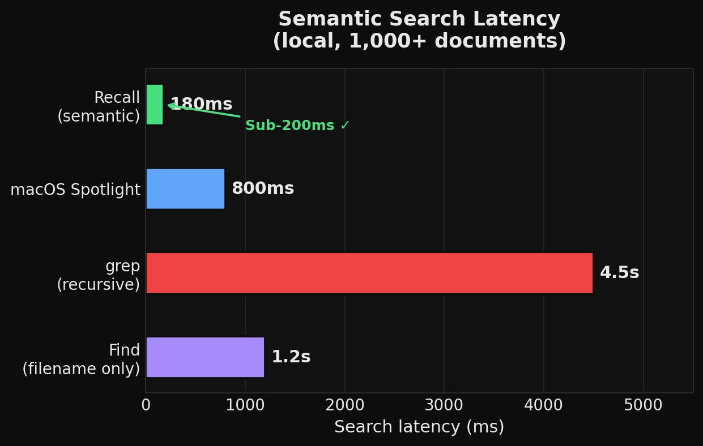
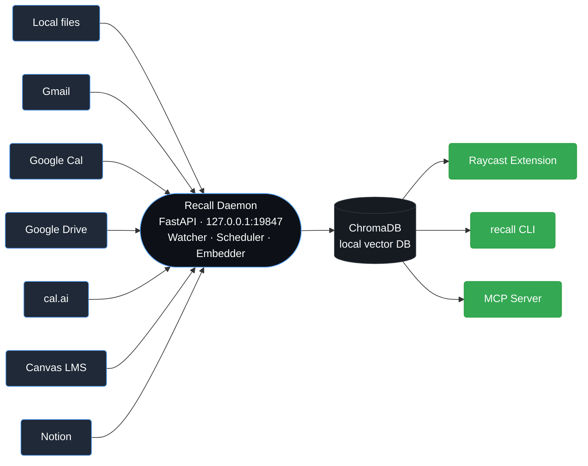
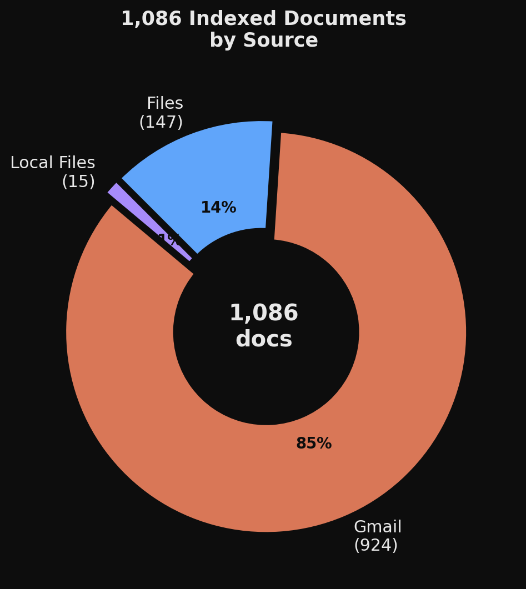
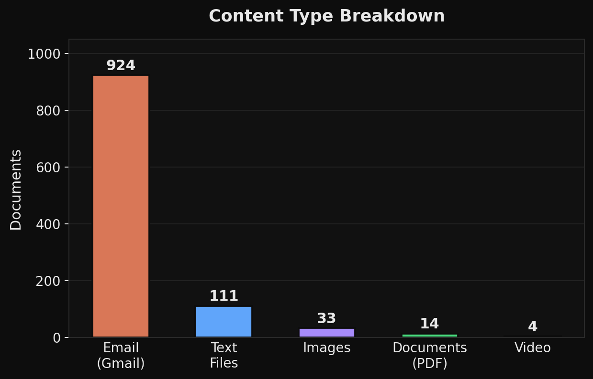

<h1 align="center">Recall</h1>
<p align="center"><em>One search box for your files, email, calendar, and notes — running entirely on your Mac.</em></p>

<p align="center">
  
  
  
  
  
</p>

Recall is a background daemon that indexes your **files, Gmail, Google Calendar, Google Drive, Canvas/Schoology, Notion, and cal.ai** into a local vector database on your Mac. Search everything from Raycast, the `recall` CLI, or any MCP client. No data leaves your machine.

```
recall search "meeting notes from last week"
recall search "golden gate bridge photo"
recall search "python async generator example"
```

- **Private.** Embeddings and tokens live on disk. The only outbound call is to your embedding provider — or zero, if you run [Ollama](https://ollama.ai) locally.
- **Fast.** Sub-200 ms semantic search over 1,000+ documents on an M-series Mac.
- **Unobtrusive.** Backs off when you're actively using the machine; ignores duplicates via SHA-256 hashing.
- **Not screen recording.** Recall indexes discrete artifacts (files, emails, events) — not your screen or microphone.

### Why local-first?

Cloud search tools (Notion AI, Mem, etc.) send your content to third-party AI providers for indexing and query processing. Recall does not. Your index is a folder on your disk — delete it with `rm -rf ~/.vef/chroma` to start over. No account deletion forms, no retention windows, no training on your data.

<p align="center">
  
</p>

---

## Contents

- [Quick start](#quick-start) — one-line install → first search in under five minutes.
- [CLI in use](#cli-in-use) — what the daily loop actually looks like.
- [How it fits together](#how-it-fits-together) — architecture at a glance.
- [Connecting sources](#connecting-sources) — Gmail, GCal, GDrive, Canvas, Schoology, cal.ai, Notion.
- [Raycast extension](#raycast-extension) — the primary UI.
- [MCP server](#mcp-server) — expose Recall to Claude Desktop / Cursor / any MCP client.
- [Reference docs](#reference-docs) — deep-dives.
- [What's new](#whats-new-in-v03) — v0.3 stability + performance.

---

## Quick start

### 0. One-line install (macOS)

```bash
curl -fsSL https://raw.githubusercontent.com/aayu22809/Recall/main/install.sh | bash
```

The installer sets up the Python package, drops `recall` / `vef-daemon` / `recall-mcp` into your `PATH`, and runs `vef-setup` if `~/.vef/.env` doesn't exist yet.

### 1. Manual install

```bash
git clone https://github.com/aayu22809/Recall.git
cd Recall
pip install -e .                 # core
pip install -e ".[setup]"        # interactive wizard (rich + questionary)
pip install -e ".[local-ai]"     # faster-whisper transcription
pip install -e ".[canvas]"       # canvasapi client
```

### 2. Pick an embedding provider

```bash
cp .env.example .env
```

Then edit `.env`:

```ini
# Option A — local Ollama (recommended, local-only embedding path)
VEF_EMBEDDING_PROVIDER=ollama
VEF_OLLAMA_EMBED_MODEL=nomic-embed-text

# Option B — Gemini Embedding 2 (free tier, 768-dim)
VEF_EMBEDDING_PROVIDER=gemini
GEMINI_API_KEY=your_key_here
```

With Ollama:

```bash
brew install ollama
brew services start ollama
ollama pull nomic-embed-text
```

### 3. Start the daemon

```bash
recall start
```

```console
✓ Daemon started (pid 42187, 3.7s)
```

Sanity check:

```bash
recall status
vef-daemon check-embed
```

### 4. Index something

```bash
recall index ~/Documents
```

Anything dropped into a watched folder from that point on is auto-indexed within 10 seconds.

### 5. Search

```bash
recall search "golden gate bridge photo"
```

Or use Raycast — see [Raycast extension](#raycast-extension).

---

## CLI in use


Every subcommand is documented in [docs/cli-reference.md](docs/cli-reference.md), but the 90 % flow is:

```bash
recall start                            # spawn daemon (idempotent)
recall connect gmail                    # OAuth, incremental after first pull
recall sync                             # trigger all connectors now
recall search "swerve drive robotics"   # semantic query
recall context "my thesis proposals"    # brief-for-AI: top 5 with snippets
recall open-memory "FRC writeup"        # search + open top result
recall stop                             # graceful shutdown
```

---

## How it fits together



A single Python process hosts the HTTP surface, a `ThreadPoolExecutor` of ingest workers, a `watchdog` filesystem observer, and a connector scheduler. Everything goes through the embedder into **one** ChromaDB collection — so a single query ranks across every source.

Design notes, endpoint map, and data-flow walk-through in [docs/architecture.md](docs/architecture.md).

### What's in the box

<table>
<tr>
<td width="50%">

</td>
<td width="50%">

</td>
</tr>
</table>

A representative index (1,086 docs from the author's machine): Gmail dominates because the Gmail connector pulls the last 6 months on first sync, then incrementally after that. Watched folders, Drive, and LMS fill in the long tail.

---

## Connecting sources

Every connector lives under `vector_embedded_finder/connectors/`. All of them:

- Persist an incremental sync token / cursor to `~/.vef/credentials/<source>.json`.
- Run on a configurable interval (`GMAIL_POLL_INTERVAL`, `GCAL_POLL_INTERVAL`, …) only when the daemon is idle.
- Emit the same `source=...` tag so you can filter searches.

| Source | Auth | Cadence | Credential file |
|---|---|---|---|
| Gmail | Google OAuth2 (Desktop app) | 15 min | `~/.vef/credentials/gmail.json` |
| Google Calendar | Google OAuth2 (Desktop app) | 30 min | `~/.vef/credentials/gcal.json` |
| Google Drive | Google OAuth2 (Desktop app) | 30 min | `~/.vef/credentials/gdrive.json` |
| cal.ai | API key | 30 min | `~/.vef/credentials/calai.json` |
| Canvas LMS | access token | 60 min | `~/.vef/credentials/canvas.json` |
| Schoology | OAuth1 (consumer key/secret) | 60 min | `~/.vef/credentials/schoology.json` |
| Notion | integration token | 30 min | `~/.vef/credentials/notion.json` |
| Local files | `watchdog` on `~/.vef/watched_dirs.json` | 2 s debounce | n/a |

### Google connectors (Gmail, GCal, GDrive)

1. In [Google Cloud Console](https://console.cloud.google.com/), create an **OAuth 2.0 Client ID** of type *Desktop app*.
2. Enable the APIs you want: Gmail API, Google Calendar API, Google Drive API.
3. Download the client JSON → save as `~/.vef/credentials/gmail_oauth_client.json`.
4. Authenticate:

   ```bash
   recall connect gmail
   recall connect gcal
   recall connect gdrive
   ```

### Canvas LMS

1. In Canvas: **Account → Settings → Approved Integrations → + New Access Token**.
2. Persist the credentials:

   ```bash
   echo '{
     "token":    "YOUR_TOKEN",
     "base_url": "https://canvas.instructure.com"
   }' > ~/.vef/credentials/canvas.json
   ```

### Schoology

1. In Schoology: **Settings → Schoology API → Generate API Key**.
2. Save:

   ```bash
   echo '{
     "consumer_key":    "YOUR_KEY",
     "consumer_secret": "YOUR_SECRET",
     "base_url":        "https://api.schoology.com"
   }' > ~/.vef/credentials/schoology.json
   ```

### cal.ai

1. API key from [cal.com/settings/developer/api-keys](https://cal.com/settings/developer/api-keys).
2. `echo '{"api_key":"cal_..."}' > ~/.vef/credentials/calai.json`

### Notion

1. Create an internal integration at [notion.so/my-integrations](https://www.notion.so/my-integrations).
2. Share the pages/databases you want indexed with the integration.
3. `echo '{"api_key":"ntn_..."}' > ~/.vef/credentials/notion.json`

All of the above are also handled by the [setup wizard](#setup-wizard).

---

## Raycast extension

The Raycast extension registers five commands:

| Command | What it does |
|---|---|
| **Search Memory** | Grid UI with source-aware result cards, semantic search, source filter dropdown |
| **Open Memory** | Headless instant top-1 opener — type, hit Enter, file opens |
| **Manage Recall** | Daemon status, watched folders editor, connector auth + sync buttons |
| **Sync Status** | Live per-connector last-sync + in-progress indicator |
| **Calendar Today** | Today's events across Google Calendar + cal.ai |
| **Email Search** | Gmail-scoped search, subject + snippet preview |

Install:

```bash
cd raycast
npm install
npx @raycast/api@latest develop
```

Then in Raycast → **Extensions → Memory Search → Configure**, set:

| Preference | Value |
|---|---|
| Python Package Path | absolute path to this repo |
| Python Binary | `/usr/bin/python3` or your venv |

The extension **auto-starts the daemon** on first invocation if it isn't running. All requests go through a shared runner (`raycast/src/lib/runner.ts`) that:

- Polls `GET /health` with a generous 2 s per-attempt timeout (no false negatives under macOS CPU contention).
- Pulls document counts from `GET /stats` (not `/health`), so the liveness probe stays constant-time.
- Surfaces typed errors: `DAEMON_UNREACHABLE`, `DAEMON_ERROR`, `NOT_CONFIGURED`, `UNKNOWN`.

---

## MCP server

Expose Recall to Claude Desktop, Cursor, or any MCP client:

```json
{
  "mcpServers": {
    "recall": { "command": "recall-mcp" }
  }
}
```

Tools registered: `recall.search`, `recall.context`, `recall.sync`, `recall.status`, `recall.index`.

---

## Setup wizard

```bash
vef-setup
```

The wizard walks through:

1. Pick embedding provider (Gemini / Ollama).
2. API key (or Ollama model pull).
3. Add watched folders.
4. Connect Gmail → GCal → GDrive → cal.ai → Canvas / Schoology → Notion.
5. Trigger the first full sync.

Screenshots of each step: [docs/images/wizard-screens.png](docs/images/wizard-screens.png).

---

## Supported file types

| Category | Extensions |
|---|---|
| **Image** | `.png` `.jpg` `.jpeg` `.webp` `.gif` `.bmp` `.tiff` |
| **Audio** | `.mp3` `.wav` `.m4a` `.ogg` `.flac` `.aac` |
| **Video** | `.mp4` `.mov` `.avi` `.mkv` `.webm` |
| **Document (PDF)** | `.pdf` — text-extracted, falls back to binary embed for scanned PDFs |
| **Text / Code** | `.txt` `.md` `.csv` `.json` `.yaml` `.py` `.js` `.ts` `.go` `.rs` `.sh` … |

### Local AI captioning (optional)

When Ollama + a vision model are installed, images are captioned and audio/video is transcribed **locally** before embedding. No binary blobs leave the machine.

```bash
ollama pull moondream             # or llava, bakllava, minicpm-v
pip install -e ".[local-ai]"      # faster-whisper
```

Probe detection:

```bash
python -c "from vector_embedded_finder.captioner import detect_capabilities; print(detect_capabilities())"
```

---

## Configuration

Everything is driven by `.env` (the repo root) **or** `~/.vef/.env` (persistent, overrides repo values). See [`.env.example`](.env.example) for the canonical list.

The knobs that matter most:

| Variable | Default | Description |
|---|---|---|
| `VEF_EMBEDDING_PROVIDER` | `gemini` | `gemini`, `ollama`, or `nim` |
| `VEF_OLLAMA_EMBED_MODEL` | `nomic-embed-text` | any Ollama embedding model |
| `VEF_EMBEDDING_DIMENSIONS` | `768` | Gemini only — `128`, `256`, `512`, `768`, `1536` |
| `VEF_PORT` | `19847` | daemon HTTP port |
| `VEF_CONCURRENCY` | `10` | ingest worker count |
| `VEF_DATA_DIR` | `./data` | ChromaDB persistence directory |
| `VEF_DIR` | `~/.vef` | credentials, PID, watched-dirs |
| `VEF_CONNECTOR_SYNC_BUDGET_S` | `600` | max seconds any sync can hold the global lock |

---

## Resource limits

The daemon is designed to be invisible on an M-series Mac.

| Constraint | Behaviour |
|---|---|
| CPU > 30 % sustained | Ingest workers + captioner back off for 5 s |
| Free RAM < 8 GB | Skip Ollama / Whisper captioning, fall back to binary embed |
| Search fired in last 30 s | Connector scheduler pauses so interactive use is never interrupted |
| `VEF_CONCURRENCY` | Upper bound on parallel ingest workers |

---

## Reference docs

- **[docs/architecture.md](docs/architecture.md)** — process model, request paths, endpoint classes, storage layout.
- **[docs/cli-reference.md](docs/cli-reference.md)** — every `recall …` / `vef-daemon …` subcommand with examples.
- **[docs/daemon-api.md](docs/daemon-api.md)** — HTTP API with request/response shapes and `curl` examples.
- **[docs/troubleshooting.md](docs/troubleshooting.md)** — fixes for the failure modes you will actually hit.
- **[docs/architecture/local-first-semantic-layer.md](docs/architecture/local-first-semantic-layer.md)** — experimental Rust + WASM runtime scaffold (Moss).
- **[AGENT_BUILD_GUIDE.md](AGENT_BUILD_GUIDE.md)** — agent-authoring guide for adding new sources / tools.

---

## What's new in v0.3

### Stability

- **`/health` is now constant-time.** The liveness probe no longer calls `chromadb.count()`, so Raycast can poll it aggressively without blocking on a backlogged DB. Document count moved to a dedicated `/stats` endpoint.
- **Robust daemon startup.** `recall start` now pre-checks the PID file *and* the TCP port, probes `/health` to distinguish "live daemon, stale PID" from "nothing running," and only reports success if the spawned child is actually alive.
- **Log rotation.** `~/.vef/daemon.log` is rotated at 2 MB with 3 backups. Repeated ChromaDB warnings are throttled to once per 60 s per message to prevent log spam.
- **Relaxed client timeouts.** Raycast's `/health` probe now allows 2 s per attempt; `validateSetup` polls `/stats` with a 5 s budget.

### Features

- **Multi-provider embeddings.** Pick between Gemini, Ollama (`nomic-embed-text` by default), or any OpenAI-compatible NIM endpoint via `VEF_EMBEDDING_PROVIDER`.
- **Seven connectors.** Gmail, Google Calendar, Google Drive, cal.ai, Canvas, Schoology, Notion — all incremental, all idle-aware.
- **Local captioning.** Ollama vision models + `faster-whisper` for fully on-device image / audio / video understanding.
- **CLI + MCP.** New `recall` command and `recall-mcp` MCP server.
- **Raycast extension refresh.** New Manage Recall, Sync Status, Calendar Today, and Email Search commands; shared `ResultCard` component with per-source styling.

See the [PR](https://github.com/aayu22809/Recall/pulls) for the full commit-level breakdown.

---

## License

MIT — see [LICENSE](LICENSE).
