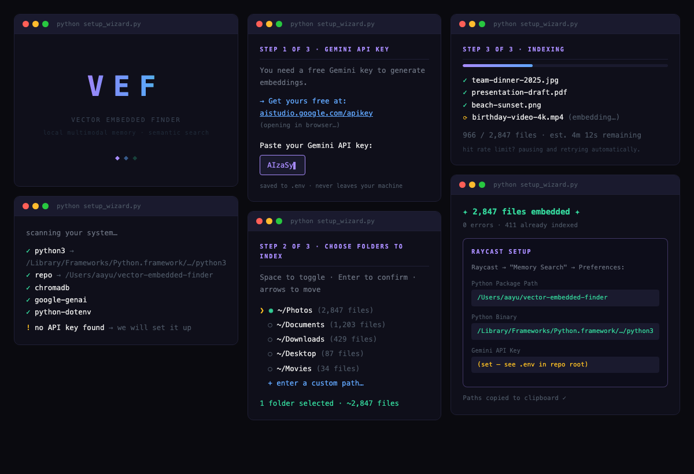

# Recall - The intelligent way to search.

**Local multimodal memory with semantic search.**

Embed images, audio, video, PDFs, and text into a local vector database — then find anything with a natural language query. A text search for *"team dinner"* surfaces the photos, even though the photos have no text metadata.

Comes with an animated setup wizard and a Raycast extension for instant visual search.

> Powered by [Gemini Embedding 2](https://ai.google.dev/gemini-api/docs/embeddings) (768-dim, free tier) and [ChromaDB](https://www.trychroma.com/) stored entirely on your machine.

---

## How it works

```
You                     Gemini Embedding 2          ChromaDB (local)
 |                            |                        |
 |-- team-dinner.jpg -------->|-- 768-dim vector ------>|-- stored on disk
 |-- meeting-notes.pdf ------>|-- 768-dim vector ------>|-- stored on disk
 |-- "team dinner" (query) -->|-- query vector -------->|-- cosine search
 |<---------------------------|<-- ranked results -------|
```

Cross-modal search works out of the box. No tagging, no renaming, no metadata required.

---

## Setup

```bash
git clone https://github.com/hughminhphan/vector-embedded-finder.git
cd vector-embedded-finder
pip install -e .
python setup_wizard.py
```

That's it. The animated setup wizard handles everything end-to-end:



| Step | What happens |
|---|---|
| **Splash** | Animated rainbow logo |
| **Auto-detect** | Finds your Python binary, repo path, and checks all deps |
| **API key** | Opens [aistudio.google.com/apikey](https://aistudio.google.com/apikey), validates your key, saves to `.env` |
| **Folder picker** | Checkbox list of your home folders with live file counts |
| **Indexing** | Progress bar with current filename, auto-retries on rate limits |
| **Raycast card** | Prints pre-filled Python Package Path and Python Binary — just copy-paste |

> **Manual key setup:** `cp .env.example .env` and add `GEMINI_API_KEY=your_key`

---

## Python API

```python
from vector_embedded_finder import search, ingest_file, ingest_directory, count

# Embed a single file — image, PDF, audio, video, or text
ingest_file("~/Photos/team-dinner.jpg")

# Embed an entire directory (recursive by default)
ingest_directory("~/Documents/", source="docs")

# Search with natural language
matches = search("team dinner at the rooftop", n_results=5)
for m in matches:
    print(f"{m['file_name']}  {m['similarity']:.0%} match  {m['file_path']}")

# Housekeeping
print(f"{count()} items indexed")
```

`ingest_file` returns `{"status": "embedded" | "skipped" | "error", ...}`.
Files are SHA-256 deduplicated — re-ingesting the same file is a no-op.

---

## Raycast extension

Visual grid search with image thumbnails, right from your launcher.

### Setup

```bash
cd raycast
npm install
npx ray develop
```

Open Raycast and search **Memory Search**. On first launch, go to Preferences and set:

| Preference | Value |
|---|---|
| **Python Package Path** | Absolute path to this repo, e.g. `/Users/you/vector-embedded-finder` |
| **Python Binary** | Path to python3, e.g. `/usr/bin/python3` |
| **Gemini API Key** | Your key (or leave blank if set in `.env`) |

> **Tip:** Run `python setup_wizard.py` first — it prints these values pre-filled for you.

### Commands

| Command | What it does |
|---|---|
| **Memory Search** | Grid UI with image/video thumbnails, 400ms debounced live search |
| **Memory Open** | Headless — type a query, instantly opens the best matching file |

---

## Supported file types

| Category | Formats |
|---|---|
| **Image** | `.png` `.jpg` `.jpeg` `.webp` `.gif` `.bmp` `.tiff` |
| **Audio** | `.mp3` `.wav` `.m4a` `.ogg` `.flac` `.aac` |
| **Video** | `.mp4` `.mov` `.avi` `.mkv` `.webm` |
| **Document** | `.pdf` |
| **Text** | `.txt` `.md` `.csv` `.json` `.yaml` `.yml` `.toml` `.py` `.js` `.ts` `.go` `.rs` `.sh` and more |

---

## Configuration

| Variable | Default | Description |
|---|---|---|
| `GEMINI_API_KEY` | *(required)* | Free key from [aistudio.google.com/apikey](https://aistudio.google.com/apikey) |
| `VEF_DATA_DIR` | `./data` | Where ChromaDB persists vectors |

---

## Architecture

```
vector_embedded_finder/
  config.py      — env, API key, supported types, paths
  embedder.py    — Gemini Embedding 2 (text, image, audio, video, PDF)
  store.py       — ChromaDB layer: cosine distance, SHA-256 dedup, upsert
  search.py      — natural language search with similarity scoring
  ingest.py      — file detection → embedding → storage pipeline
  utils.py       — hashing, MIME detection, timestamp helpers

raycast/
  src/lib/runner.ts       — Python bridge: spawnSync + JSON envelope protocol
  src/search-memory.tsx   — grid search UI with thumbnails
  src/open-memory.tsx     — headless instant file opener

setup_wizard.py           — animated CLI setup: key → folders → index → Raycast card
```

All vectors are stored locally in `data/chromadb/`. The only outbound traffic is embedding API calls to Google — your files never leave your machine.

---

## License

MIT
