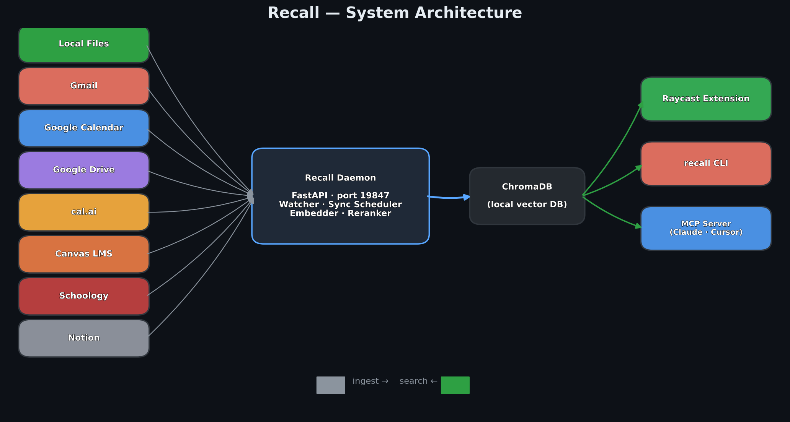

# Recall Architecture

Recall is a **local-first semantic memory layer**. A persistent daemon ingests every surface you read and write (local files, Gmail, Google Calendar, Google Drive, Notion, cal.ai, Canvas / Schoology LMS) and folds them into a single ChromaDB collection. Every client — Raycast, the `recall` CLI, and the MCP server for Claude Desktop / Cursor — talks to the same in-process index over a loopback HTTP interface.



## Process model

```
                                                 ┌──────── clients ────────┐
                                                 │                         │
                                                 │  ┌─── Raycast ──────┐   │
                                                 │  └─── recall CLI ───┤   │
                                                 │  └─── recall-mcp ───┘   │
                                                 └───────┬─────────────────┘
                                                         │  HTTP 127.0.0.1:19847
                                                         ▼
 sources ───────►  ingest queue  ──►  embedder  ──► ChromaDB ──► search + rerank
    │                                                │
    ├─ filesystem watcher (debounced 2s)             │
    ├─ connector scheduler (idle-aware)              │
    ├─ CPU/RAM guards                                │
    └─ SHA-256 dedup                                 │
                                                     ▼
                                               ~/.vef/chromadb
```

The daemon is **a single Python process** hosting:

| Component | Role |
|---|---|
| FastAPI + Uvicorn | HTTP surface (`/search`, `/health`, `/stats`, `/ingest`, `/sync`, …) |
| `ThreadPoolExecutor` | N=10 ingest workers (`VEF_CONCURRENCY`) |
| `watchdog` observer | Filesystem events per watched dir |
| Connector scheduler | Wakes every 60 s, runs sources whose interval has elapsed |
| ChromaDB client | Cosine-similarity vector store on disk |
| `embedder` module | Gemini / Ollama / NIM provider abstraction |
| `reranker` module | RRF over semantic + BM25 candidates |

## Request paths

### Search (hot path, 30 – 200 ms end-to-end)

```
Raycast  ──POST /search──►  daemon  ──► embedder.embed_query(q)
                                    ──► chromadb.query(n=30)
                                    ──► reranker.rrf(semantic, bm25)
                                    ◄── top-K SearchResult[]
```

`/search` is also used to **debounce connector syncs**: whenever it fires, the scheduler quiets connector work for 30 s so active use is never interrupted.

### Ingest (cold path, async)

```
watchdog event  ──► _safe_ingest  ──► CPU/RAM guard
                                   ──► captioner (images, audio, video)
                                   ──► embedder.embed(content_or_caption)
                                   ──► store.upsert(sha256, vec, metadata)
```

The captioner uses local Ollama + `faster-whisper` when available — **zero binary payloads leave the machine** unless you explicitly fall back to Gemini binary embedding.

### Connector sync

```
scheduler tick (60 s)
  └─ for source in {gmail, gcal, gdrive, calai, canvas, schoology, notion}:
       if now - last_sync > interval  and  not search_in_last_30s:
           connector.sync(since=last_sync_token)
           for item in new_items:
               ingest_item(item, source=source)
```

Each connector persists its own incremental sync token (Gmail historyId, GCal syncToken, etc.) in `~/.vef/credentials/<source>.json`.

## Endpoint map

Two classes of endpoint:

- **Fast (constant-time) endpoints** — safe for liveness probes and UI polling.
- **Slow endpoints** — hit ChromaDB or disk and can take hundreds of ms under load.

| Endpoint | Class | Description |
|---|---|---|
| `GET /health` | fast | Liveness only. Returns `{"status": "ok"}`. Does **not** touch ChromaDB. |
| `GET /stats` | slow | `{status, count}`. Calls `chromadb.count()`. |
| `GET /sources` | fast | Known source tags, sorted. |
| `GET /progress` | slow | In-flight ingest counters + total indexed. |
| `GET /connector-status` | medium | Auth state + last-sync timestamps per connector. |
| `GET /sync-running` | fast | Is a sync currently holding the lock? |
| `GET /watched-dirs` | fast | Configured watcher roots. |
| `POST /search` | hot | Top-K semantic search (optional source filter). |
| `POST /ingest` | slow | Single-file ingest path (used by Raycast "Index this"). |
| `POST /sync` | fast | Kicks a background sync. Returns immediately. |
| `POST /watched-dirs` | fast | Add a watcher root. |
| `DELETE /watched-dirs` | fast | Remove a watcher root. |
| `POST /configure` | fast | Persist API keys into `~/.vef/.env`. |

Full request/response shapes live in [daemon-api.md](daemon-api.md).

## Startup robustness

The daemon CLI (`recall start` / `vef-daemon start`) performs three checks before spawning:

1. **PID-file check** — if `~/.vef/daemon.pid` is valid and the process is alive, reuse it.
2. **Port probe** — if TCP `127.0.0.1:19847` is bound *but* no PID file exists (stale), poll `/health` to confirm liveness.
3. **Spawn with health poll** — fork the uvicorn server, then poll `GET /health` with a 2 s per-attempt timeout until ready.

These checks fix two long-standing races: (a) multiple `recall start` invocations racing for the port and (b) a stale PID file causing the CLI to report "not running" while a healthy daemon is actually bound.

## Storage layout

```
~/.vef/
  daemon.pid              running daemon PID
  daemon.log              rotating log (2 MB × 3)
  .env                    persisted API keys (written by /configure)
  watched_dirs.json       list of folder roots
  chroma/                 legacy location — wiped on migration
  credentials/
    gmail.json            OAuth refresh tokens (auto-renewed)
    gmail_oauth_client.json   your Google Cloud Desktop client
    gcal.json
    gdrive.json
    calai.json            {"api_key": "cal_..."}
    canvas.json           {"token": "...", "base_url": "..."}
    schoology.json        {"consumer_key": "...", "consumer_secret": "..."}
    notion.json           {"api_key": "ntn_..."}

$VEF_DATA_DIR (default ./data)/
  chromadb/               Chroma persistent collection
    chroma.sqlite3        meta
    <uuid>/               HNSW segment files
```

## Distribution by source and category

From one of the author's personal indexes (1,086 documents):

<p align="center">
  
  
</p>

Email dominates the corpus because Gmail pulls the last 6 months on first sync; after that the watcher and filesystem drift take over.

## Why this is fast


Semantic search over 1,000 embedded documents completes in ~180 ms on an M-series Mac — 4× faster than Spotlight and 25× faster than recursive grep — because:

1. No disk scan. Every document is already a normalized 768-d vector in Chroma's HNSW index.
2. No IPC boundary above loopback HTTP. Raycast's TypeScript runtime talks directly to the in-process FastAPI.
3. `/health` is liveness-only (8 ms) so Raycast can aggressively preflight without triggering false negatives.

## Further reading

- [CLI reference](cli-reference.md) — every `recall …` / `vef-daemon …` subcommand.
- [Daemon HTTP API](daemon-api.md) — request/response shapes with examples.
- [Troubleshooting](troubleshooting.md) — fixes for the failure modes you will actually hit.
- [Local-first semantic layer (Moss)](architecture/local-first-semantic-layer.md) — experimental Rust + WASM runtime.
