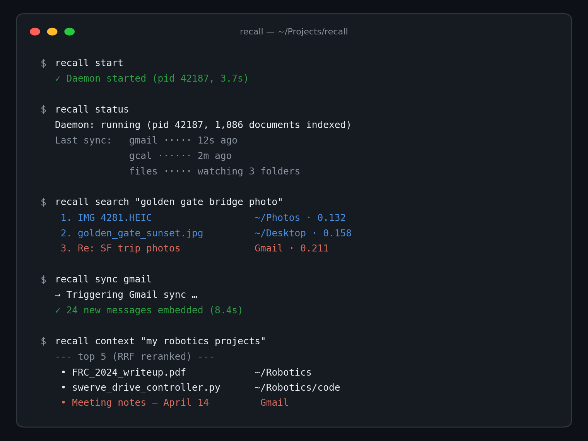

# CLI reference

Recall ships two binaries, installed by `pip install -e .`:

- **`recall`** — user-facing CLI (also available as `trayce` for legacy reasons).
- **`vef-daemon`** — low-level daemon-management commands.

Both talk to the daemon over loopback HTTP (`127.0.0.1:19847`). When the daemon isn't running, `recall start` will launch it in the background.



## `recall start`

Start the daemon as a background process (or attach to the one already running).

```console
$ recall start
✓ Daemon started (pid 42187, 3.7s)
```

Behaviour:

- If `~/.vef/daemon.pid` points to a live process, prints `Daemon already running (pid …)` and returns in < 300 ms.
- If the port is bound but no PID file exists (stale state), polls `GET /health` to confirm liveness before reporting "already running."
- Otherwise forks a Uvicorn server and polls `GET /health` until ready (2 s per attempt, 10 s total).

## `recall stop`

Graceful shutdown via `SIGTERM`, then `SIGKILL` fallback after 5 s.

```console
$ recall stop
✓ Daemon stopped (pid 42187)
```

## `recall status`

Human-readable snapshot of the whole system.

```console
$ recall status
Daemon: running (pid 42187, 1,086 documents indexed)

Connectors:
  gmail     ✓ authed · last sync 12s ago  · interval 15m
  gcal      ✓ authed · last sync  2m ago  · interval 30m
  gdrive    ✓ authed · last sync  8m ago  · interval 30m
  calai     ✗ not authed
  canvas    ✓ authed · last sync 42m ago  · interval 60m
  schoology ✗ not authed
  notion    ✗ not authed

Watched folders:
  ~/Documents
  ~/Projects
  ~/Desktop/inbox
```

Internally this fans out to `GET /stats`, `GET /connector-status`, and `GET /watched-dirs`.

## `recall search QUERY`

Run a semantic query.

```console
$ recall search "golden gate bridge photo"
 1. IMG_4281.HEIC                    ~/Photos · 0.132
 2. golden_gate_sunset.jpg           ~/Desktop · 0.158
 3. Re: SF trip photos               Gmail · 0.211
```

Flags:

| Flag | Description |
|---|---|
| `--source files,gmail,…` | Comma-separated filter. Use `recall sync sources` to list. |
| `-n, --limit N` | Max results (default `10`). |
| `--json` | Emit machine-readable JSON. |

## `recall context TOPIC`

Returns a short natural-language brief over the top results — designed as a drop-in "fetch context for my prompt" for AI agents.

```console
$ recall context "my robotics projects"
--- top 5 (RRF reranked) ---
 • FRC_2024_writeup.pdf               ~/Robotics
 • swerve_drive_controller.py         ~/Robotics/code
 • Meeting notes — April 14           Gmail
 …
```

## `recall sync [SOURCE]`

Kicks a background connector sync. Returns immediately (fire-and-forget).

```console
$ recall sync gmail
→ Triggering Gmail sync …
✓ 24 new messages embedded (8.4s)

$ recall sync                    # sync every configured source
→ Triggering full sync of 5 connectors …
```

Sync events are logged in `~/.vef/daemon.log`.

## `recall index PATH`

Ingests a single file or a directory. Equivalent to `POST /ingest` per file.

```console
$ recall index ~/Downloads/report.pdf
✓ Embedded (384 tokens, 742 ms)

$ recall index ~/Documents/Thesis
Indexing 128 files …
✓ 126 embedded, 2 skipped (duplicate sha256)
```

The global file watcher also auto-indexes anything dropped into a configured watched folder.

## `recall connect SOURCE`

Launches the OAuth (or API-key) dance for a connector.

```console
$ recall connect gmail
Opening browser for Google OAuth …
✓ Gmail authenticated. Initial sync will run within 60s.
```

Supported sources: `gmail`, `gcal`, `gdrive`, `calai`, `canvas`, `schoology`, `notion`.

## `recall open-memory QUERY`

Headless top-1: runs search, then `open -R` on the first hit. Used by Raycast's instant-file-opener command.

```console
$ recall open-memory "FRC writeup"
Opening: /Users/aayu/Robotics/FRC_2024_writeup.pdf
```

## `vef-daemon check-embed`

Round-trips a probe query through the configured embedding provider and prints the provider, model, and embedding dimension.

```console
$ vef-daemon check-embed
provider: ollama
model:    nomic-embed-text
dim:      768
ok:       true (214 ms)
```

Use this after switching `VEF_EMBEDDING_PROVIDER` to verify the new provider is reachable *before* you re-ingest.

## `vef-setup`

Interactive setup wizard. Walks you through:

1. Pick embedding provider (Gemini vs Ollama).
2. Paste / generate API key.
3. Add watched folders.
4. Connect Gmail, GCal, GDrive, cal.ai, Canvas / Schoology, Notion.
5. Run a first sync.

```console
$ vef-setup
```

## `recall-mcp`

Starts the MCP server on stdio for Claude Desktop / Cursor / any MCP client. Tools exposed: `recall.search`, `recall.context`, `recall.sync`, `recall.status`, `recall.index`.

```json
{
  "mcpServers": {
    "recall": { "command": "recall-mcp" }
  }
}
```

## Environment variables

See [`.env.example`](../.env.example) for the full list. The most load-bearing ones:

| Var | Default | Use |
|---|---|---|
| `VEF_EMBEDDING_PROVIDER` | `gemini` | `gemini`, `ollama`, or `nim` |
| `VEF_OLLAMA_EMBED_MODEL` | `nomic-embed-text` | any Ollama embedding model |
| `VEF_PORT` | `19847` | daemon HTTP port |
| `VEF_CONCURRENCY` | `10` | ingest worker count |
| `VEF_CONNECTOR_SYNC_BUDGET_S` | `600` | max time any single connector sync can hold the lock |
| `VEF_DATA_DIR` | `./data` | where ChromaDB persists |
| `VEF_DIR` | `~/.vef` | credentials, PID, watched-dirs |
