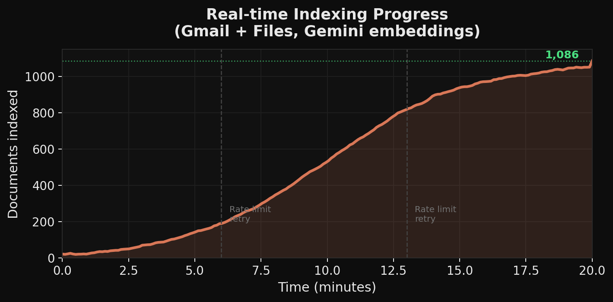

# Troubleshooting

## "Daemon process spawned but did not respond within 10s"

**Symptom.** `recall start` prints the message above; `~/.vef/daemon.log` shows repeated `Chroma count failed` warnings or a `hnsw_segment_writer … InternalError`.

**Root cause.** Your ChromaDB store holds two collections with mismatched embedding dimensions (usually because you switched providers mid-index). `chromadb.count()` inside `/health` then serialises and blocks forever.

**Fix.**

```bash
recall stop
rm -rf ./data/chromadb ~/.vef/chroma
recall start
```

Then re-ingest. Everything else is preserved (watched folders, credentials, OAuth tokens).

As of v0.3, `/health` no longer calls `chromadb.count()`, so the daemon stays responsive even if the DB is corrupted — but the corrupted DB still needs wiping before you can query again.

## "Daemon says running but Raycast shows 0 documents"

Raycast reads the document count from `GET /stats`, not `/health`. If `/stats` returns 0, the daemon is healthy but genuinely has no indexed docs yet. Check:

```bash
recall status        # total count
recall sync gmail    # force a connector sync
tail -F ~/.vef/daemon.log
```

If the watcher isn't catching file drops, verify `~/.vef/watched_dirs.json` contains the folder.

## `chromadb.errors.InternalError: hnsw segment writer …`

Same root cause as above — mismatched embedding dimensions from provider switching. Wipe `./data/chromadb` and restart.

## "search failed: this operation was aborted"

Raycast aborts `/search` after 5 s by default. The daemon shouldn't take that long; if it does:

1. Check for concurrent ingest backpressure: `recall status` + `GET /progress`.
2. Tail the log for slow embedder requests (Gemini rate limits, Ollama CPU).
3. Raise the client timeout: edit `raycast/src/lib/runner.ts` → `abortAfter(5000)`.

If you're on Gemini's free tier, switching to local Ollama (`VEF_EMBEDDING_PROVIDER=ollama`) removes the network round-trip entirely.

## "Gmail authenticated but no messages"

1. Confirm Gmail API is enabled in Google Cloud Console for the project whose OAuth client you downloaded.
2. `cat ~/.vef/credentials/gmail.json` — should contain a `refresh_token`. If not, re-run `recall connect gmail`.
3. First sync pulls the last 6 months. On a large inbox this takes a while (see the indexing-growth chart in [architecture.md](architecture.md)).



## "EADDRINUSE: port 19847"

You already have a daemon running or another process is squatting the port.

```bash
lsof -iTCP:19847 -sTCP:LISTEN       # who holds it
recall stop                         # our daemon
kill -9 <pid>                       # nuclear option
```

Change the port persistently by setting `VEF_PORT=29847` in `~/.vef/.env` (or `.env` in the repo).

## Log file is huge

Shouldn't happen anymore (rotation caps at 2 MB × 3 backups), but if you have an old install:

```bash
: > ~/.vef/daemon.log       # truncate in place
```

`_safe_count` warnings are now throttled to once per 60 s per unique message.

## "PID file exists but no process"

Stale PID file from a crash. `recall start` handles this automatically since v0.3: it probes the port and, if no daemon answers `/health`, removes the stale file and spawns a new daemon. If you're on an older build:

```bash
rm ~/.vef/daemon.pid
recall start
```

## Ollama: "connection refused"

```bash
brew services start ollama
ollama pull nomic-embed-text
curl -s http://127.0.0.1:11434/api/tags | jq .
```

Then `vef-daemon check-embed` to confirm Recall can reach it.

## Canvas / Schoology tokens expiring

Canvas access tokens rotate every 90 days by default. Re-run:

```bash
recall connect canvas
```

Schoology is OAuth1 — tokens don't expire, but the shared-secret can be rotated from Schoology settings. After rotating, update `~/.vef/credentials/schoology.json`.

## CPU pinned at 100 %

Check what's running:

```bash
top -o cpu | grep -E 'python|ollama|whisper'
```

Expected offenders:

- **Whisper transcription** on a long audio/video file — single-threaded but CPU-heavy. Captioning will back off when CPU > `CPU_GUARD_PERCENT` (30 % by default).
- **Ollama embedding** on a cold model load. Subsequent calls are much faster.

Tune `VEF_CONCURRENCY` down if the daemon is competing with interactive work.

## Raycast says "Python binary not found"

Set both preferences in Raycast → Extensions → Memory Search:

- **Python Package Path**: the absolute path to this repo (e.g. `/Users/you/mumbai`).
- **Python Binary**: `/usr/bin/python3`, `/opt/homebrew/bin/python3`, or your venv (`.venv/bin/python`).

The extension shells out via `osascript` and inherits `PATH` from Finder, which may not include your venv.

## Nothing above matched

Capture a report and open an issue:

```bash
cat > recall-diagnostics.txt <<EOF
=== version ===
python -c "import vector_embedded_finder as v; print(v.__version__)"

=== daemon ===
$(recall status 2>&1)

=== health ===
$(curl -s localhost:19847/health)

=== stats ===
$(curl -s localhost:19847/stats)

=== recent log ===
$(tail -n 200 ~/.vef/daemon.log)
EOF
```
